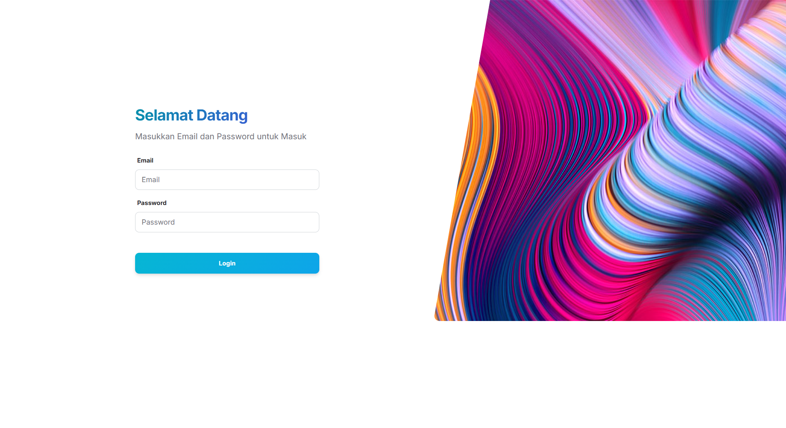
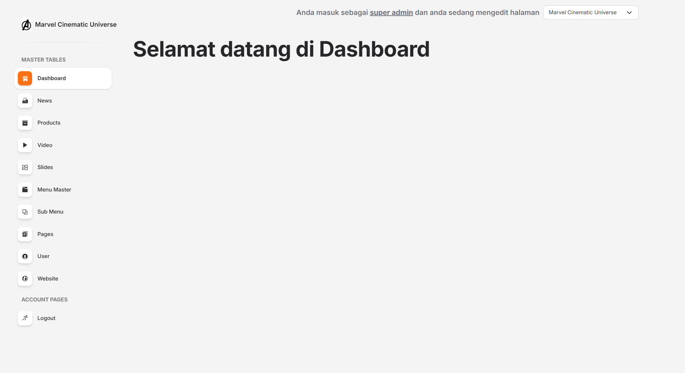
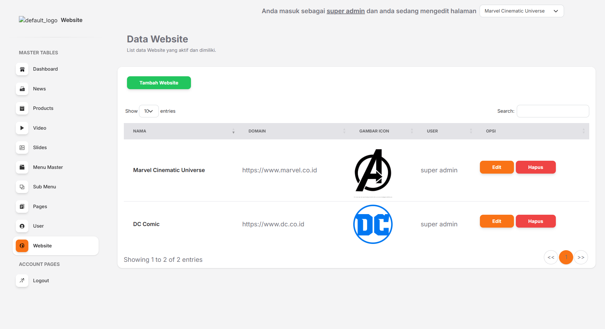
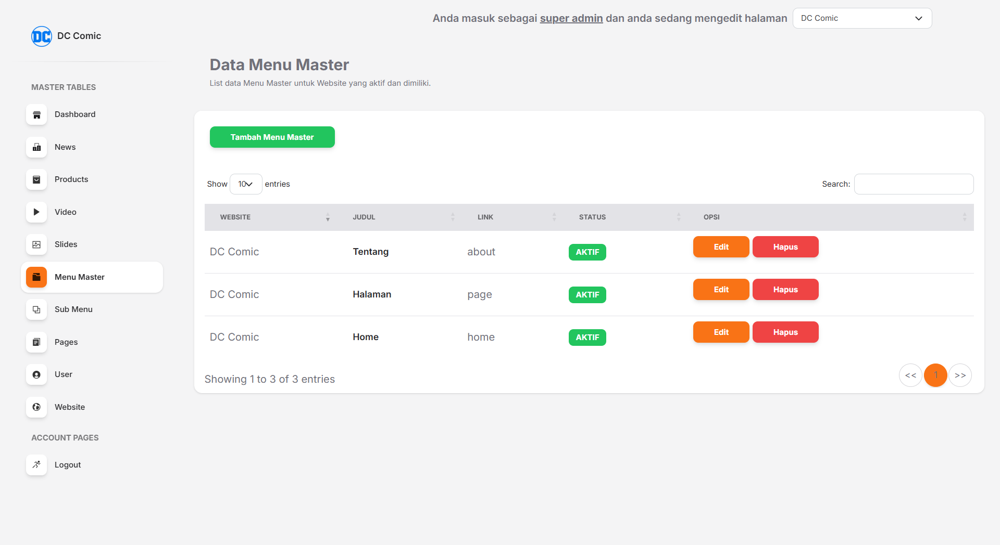

# Company Profile API

A simple backend to manage one or multiple company profiles, with accessible API endpoints for products, news, slides, videos, menus, and pages.

---

## 🙏 Acknowledgements

This project uses the [Soft UI Dashboard](https://www.creative-tim.com/product/soft-ui-dashboard) template by [Creative Tim](https://www.creative-tim.com).

---

## 🔑 Login
- **Email**: `superadmin`  
- **Password**: `123`  

---

## 🗄️ Database
The database file is located at: \database\dashboardsweb.sql

---

## 📡 API Endpoints

### Products
- [http://127.0.0.1:8000/api/products?id=1](http://127.0.0.1:8000/api/products?id=1)  
- [http://127.0.0.1:8000/api/products?id=2](http://127.0.0.1:8000/api/products?id=2)  

### News
- [http://127.0.0.1:8000/api/news?id=1](http://127.0.0.1:8000/api/news?id=1)  
- [http://127.0.0.1:8000/api/news?id=2](http://127.0.0.1:8000/api/news?id=2)  

### Slides
- [http://127.0.0.1:8000/api/slides?id=1](http://127.0.0.1:8000/api/slides?id=1)  
- [http://127.0.0.1:8000/api/slides?id=2](http://127.0.0.1:8000/api/slides?id=2)  

### Video
- [http://127.0.0.1:8000/api/video?id=1](http://127.0.0.1:8000/api/video?id=1)  
- [http://127.0.0.1:8000/api/video?id=2](http://127.0.0.1:8000/api/video?id=2)  

### Menu Master
- [http://127.0.0.1:8000/api/menumaster?id=1](http://127.0.0.1:8000/api/menumaster?id=1)  
- [http://127.0.0.1:8000/api/menumaster?id=2](http://127.0.0.1:8000/api/menumaster?id=2)  

### Submenu
- [http://127.0.0.1:8000/api/submenu?id=1](http://127.0.0.1:8000/api/submenu?id=1)  
- [http://127.0.0.1:8000/api/submenu?id=2](http://127.0.0.1:8000/api/submenu?id=2)  

### Pages
- [http://127.0.0.1:8000/api/pages?id=1](http://127.0.0.1:8000/api/pages?id=1)  
- [http://127.0.0.1:8000/api/pages?id=2](http://127.0.0.1:8000/api/pages?id=2)  

---

## 📊 Dashboard Preview

### Preview Login

### Preview Home

### Preview Master Table Website

### Preview Master Table Menu

